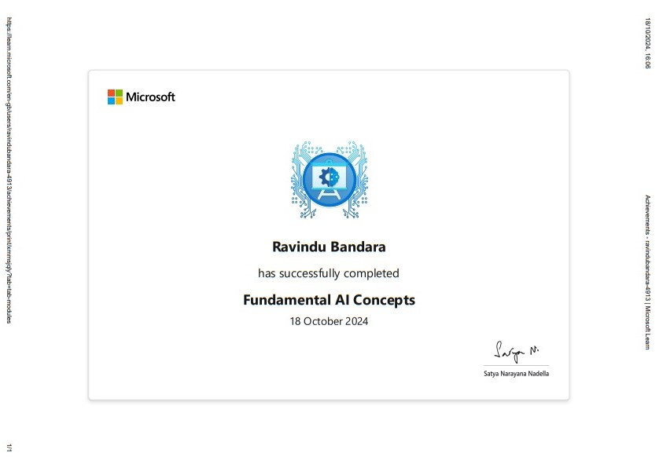
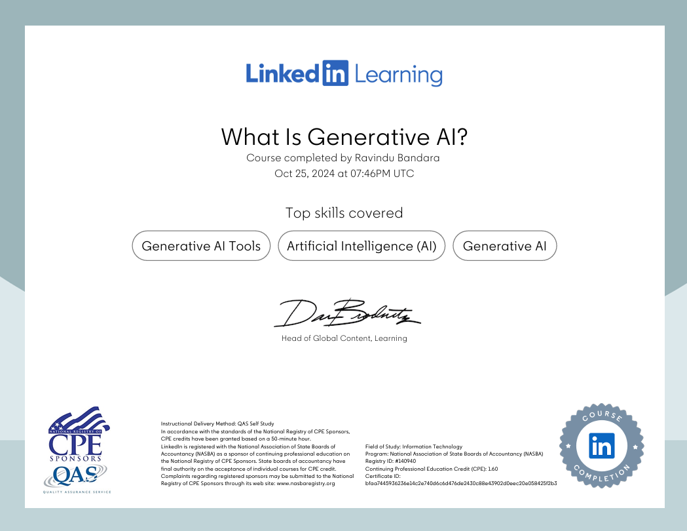

<!--Header-->

  

<!--first gif-->

  

<!--Introduction-->
<h1 align="center">Hi , I'm Ravindu Bandara</h1>

  

    
  

<!--Spotify Songs-->

  

<!--profile views-->

 
   

<!--about me-->
<table align="center">
  <tr border="none">
  <td width="50%" align="left">

- 🌱 I’m currently learning **C#, Python, HTML, CSS, JavaScript, PHP, Java**

- 🧑‍🎓 I'm an undergraduate student of **NSBM Green University and University of Plymouth**

- 💬 Ask me about **JAVA, HTML, CSS**

- ⚡ Call me as **Ravindu**

  </td>
  <td width="50%" align="center">
    
  <!--sun rise loop gif-->
  

  </td>
  </tr>
</table>

<!--break line-->

<!--my gitHub stats-->
<h3 align="center">📊 My GitHub Stats: </h3>

<table align="center">
  <tr border="none">
  <td width="50%" align="center">

  
  
    
   
  </td>
  <td width="50%" align="center">

  

  
  </td>
  </tr>
</table>

<!--break line-->

<!--my repository-->
<h3 align="center">🚀 My Repository: </h3>
<table align="center">
  <tr>
    <td>
      
    </td>
    <td>
      
    </td>
  </tr>
</table>

<!--break line-->

<!--my top contributed repo-->
<h3 align="center">🌀 My Top Contributed Repo: </h3>

  

<!--break line-->

<!--my top contribution graph-->
<h3 align="center">🔥 My Top Contribution Graph: </h3>

  

  
<!--break line-->

<!--my certificates-->
<h3 align="center">📠My Certificates: </h3>
  

      
      
      
      
      
      
      
      
      
      
      
      
      
      
      
      
      
      
      
      
      
      
      
      
      
  

     

<!--break line-->

<!--my trophies-->
<h3 align="center">🆠My Trophies: </h3>
  

<!--break line-->

<!--my random dev quote-->
<h3 align="center">✍️ My Random Dev Quote: </h3>

<!--break line-->

<!--connect with me-->
<h3 align="center">🌠Connect with me: </h3>

  
  
  

<!--break line-->

<!--my tech stack-->
<h3 align="center">💻 My Tech Stack: </h3>

 
  
  
  
  
  
   
  
  
  
  
  
  
   
   
  
   
  
  
  
  
  
  
  
  
  
  
  
  
  

<!--break line-->

<!--currently in use-->
<h3 align="center">🃠Currently in use: </h3>

| Title                          | Icon                                                                                                             |
|--------------------------------|------------------------------------------------------------------------------------------------------------------|
| Programming Languages          |                                                        |
| Scripting Languages            |                                                              |
| Tools                          |                                             |
| Databases                      |                                                                 |
| Version Control                |                                                  |

<!--break line-->

<!--support-->
<h3 align="center">🤠Support: </h3>

  

  

<!--footer-->

     

